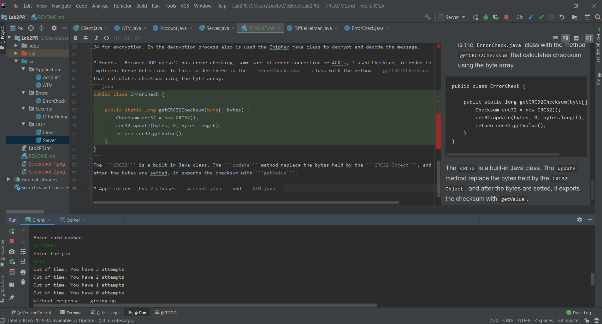
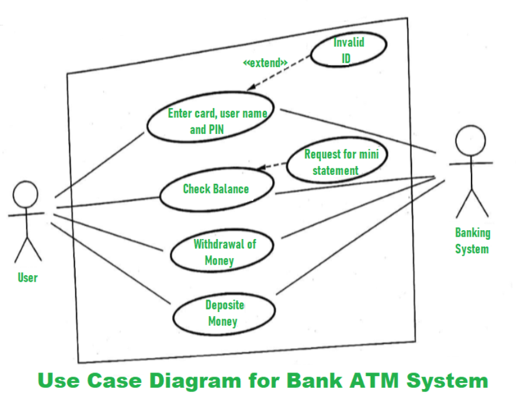
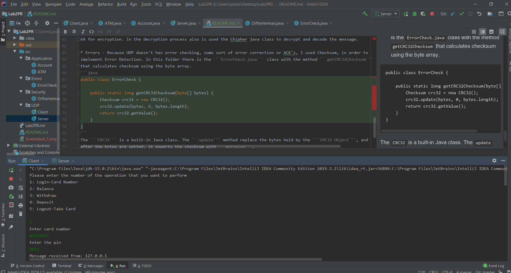

# Network Programming - Laboratory work no 2

Student: Postovan Teodora

Professor: Burlacu Alexandru

## Task Description
 * Implement a protocol atop UDP, with error checking and retransmissions. Limit the number of retries for retransmissions.
 * Make the connection secure, using either a CA to get the public key of the receiver and encrypt data with it, or using 
   Diffie-Hellman to get a shared connection key between the client and server, ensure that the traffic is encrypted.
 * Regarding the application-level protocol, you have 3 options:
   - make an FTP-like protocol for data transfer, thus you will need to ensure data splitting and in-order delivery and 
   reassembly at the destination. The protocol must support URIs, file creation and update (PUT), file fetching (GET) and 
   metadata retrieval (OPTIONS)
   - make a protocol based on the workings (state machine) of an ATM
   - make a protocol based on the workings (state machine) of a stationary telephone
   
## Implimentation

The laboratory is divided into several folders, each responsible for a specific role in the connection.

 * UDP - 
    With two classes ```Server.java``` and ```Client.java```. In order to implement a UDP client-server connection I used 
    two main classes ```DatagramSocket```(the mechanism used to send and receive packets) and ```DatagramPacket```(data container).
    ```Server.java``` and ```Client.java``` have a main method, and the port = 4300 for the connection. If the client want 
    to send a message to the server,
    it create a DatagramPacket and use the method ```send(DatagramPacket)``` method:
    ```java
   DatagramPacket outPacket = new DatagramPacket(encryptedOutData, encryptedOutData.length, address, port);
    ```
   In order to resend packets that have been lost or damaged, and to provide a reliable communication, in the ```Client.java```,
   is implemented a retransmission mechanism, that use MaxRetransmission = 4 and the TIMEOUT = 2000 (miliseconds):
   
  ```java
                //retransmission
                int attempts = 0;      // Packets may be lost, so we have to keep trying send data
                boolean ACK = false;

                do {
                    clientSocket.send(outPacket);
                    try {
                        clientSocket.receive(inPacket);

                        if (!inPacket.getAddress().equals(address)) {
                            throw new IOException("Unknown source");
                        } else {
                            System.out.println("Message received from: " + outPacket.getAddress().getHostAddress());
                        }
                        ACK = true;
                    } catch (InterruptedIOException e) {
                        attempts += 1;
                        System.out.println("Out of time. You have " + (MaxRetransmission - attempts) + " attempts");
                    }

                } while ((!ACK) && (attempts < MaxRetransmission));
  ```



* Security -  For a secure connection I tried to implement the Diffie Hellman algorithm for key exchange. In order to 
accomplish the goal were created the methods : ```setKeyPairGenerator``` and ```setPublicKey``` to generate a key pair 
and shared secret code. Also for encryption and decryption process,  was implemented the respectively classes. In the 
last 2 mentioned methods I used ```Java Chipher``` class. The AES algorithm is used, and the result is encoded into base
64 for encryption. In the decryption process also is used the Chipher java class to decrypt and decode the message.

* Errors - Because UDP doesn't has error checking, some sort of error correction or ACK's, I used Checksum, in order to 
implement Error Detection. In this folder there is the ```ErrorCheck.java``` class with the method ```getCRC32Checksum```
that calculates checksum using the byte array.
```java
public class ErrorCheck {

    public static long getCRC32Checksum(byte[] bytes) {
        Checksum crc32 = new CRC32();
        crc32.update(bytes, 0, bytes.length);
        return crc32.getValue();
    }
}
```
The ```CRC32``` is a built-in Java class. The ```update``` method replace the bytes held by the ```CRC32 Object```, and
after the bytes are set, it exports the checksum with ```getValue```.

* Application - has 2 classes ```Account.java``` and ```ATM.java```.
I followed the use case from the image + logout operation: 

I tried to implement the first Operation of login with 2 steps:
1. Enter card number
2. Enter Pin

But there are many bugs because of some flaw in the logic of the implementation. For example, even I enter a non-existing
card number, I also received response ```Message received from: 127.0.0.1```

* Sources
1. https://www.codejava.net/java-se/networking/java-udp-client-server-program-example
2. https://www.binarytides.com/udp-socket-programming-in-java/
3. https://www.cs.wmich.edu/alfuqaha/cs595/lectures/lecture6.pdf
4. http://tutorials.jenkov.com/java-networking/udp-datagram-sockets.html
